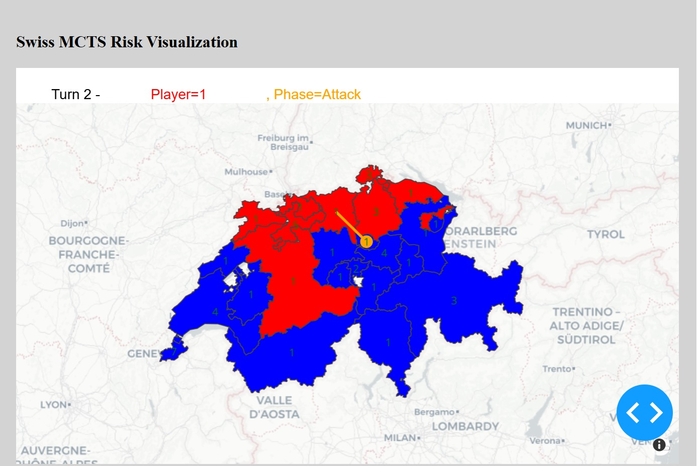

# Modular Multi-Agent Risk Game Engine with MCTS

This repository provides a  **modular**, and **multi-agent** implementation of the board game _Risk_, integrating **Monte Carlo Tree Search (MCTS)** for decision-making and a lightweight **visualization** layer. Originally inspired by prior work on AI-driven Risk, this project has been **rewritten in Go** to improve performance and support **distributed** multi-agent simulations. Python is used for real-time visualization via HTTP.

## Project Highlights

- **Go-Based Core**: The main engine (game logic, MCTS integration, etc.) is written in Go for efficiency.  
- **Multi-Agent Architecture**: Each player agent runs as its own process, communicating with the Game Master via HTTP.  
- **Visualization**: A separate Python/Flask app receives state updates in JSON form, rendering a real-time map and troop positions.  

---

## Visual Overview

**1. Swiss MCTS Risk Visualization**  


This diagram shows the **multi-process flow** between the MCTS Player Agent, the Game Master, and the Visualization module.  
- The **Game Master** requests moves and updates the global game state.  
- Each **MCTS Player Agent** waits for a move request, finds all legal moves, selects one using MCTS, then replies via HTTP.  
- The **Visualization** component receives game-state updates (also via HTTP) and renders them for display.  


**2. MCTS Player Agent and Game Master Flow**  


---

## Quick Start

1. **Clone and Switch Branch**
   ```bash
   git clone https://github.com/christopherWilliams98/risk-agent.git
   cd risk-agent
   git checkout christopherWilliams98-multi-agent

2. **Install Python Dependencies**  
   Ensure you have Python 3 installed, then run:  
   ```bash
   pip install -r requirements.txt

3. **Run the Visualization**  
   Open a terminal and execute:  
   ```bash
   python visualizer.py
   
Then open http://127.0.0.1:5000/ in your browser.

4. **Run the Game Master in Go**  
   Open a second terminal and execute:  
   ```bash
   go run main.go

Refresh the browser page to see updates in the visualization. It may take a few seconds for changes to reflect.
