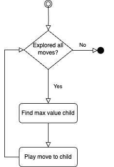
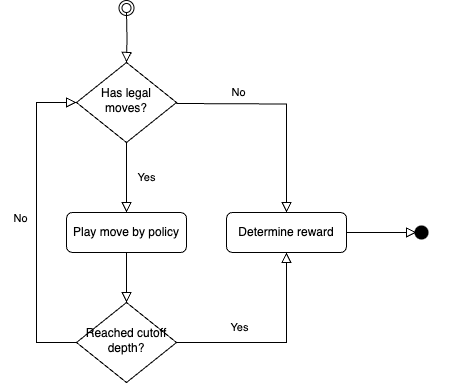
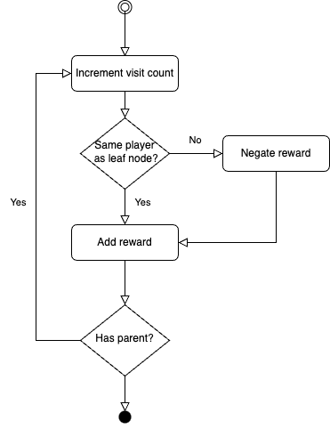
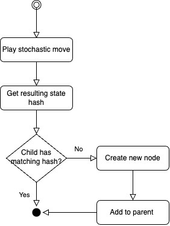

# Abstract

# Introduction 
## Background 
## Problem Statement 
## Proposed Solution

# Prior Work 
<!-- DONE: transition: 1) motivation, purpose, scope of work 2) MCTS, parallelization, stochasticity, action pruning, other risk agents -->
This chapter examines the core MCTS algorithm and various techniques, including parallelization for computational scaling, handling of stochastic events, and management of expansive state and action spaces, developed to handle complex stochastic games such as Risk. We also review prior work specific to implementing game-playing agents for Risk. Through this examination of established approaches, we lay the technical foundation for our enhanced MCTS-based Risk agent.


## Monte-Carlo Tree Search (MCTS)
<!-- MCTS: 1) definition 2) idea: how/why it works -->
MCTS (Coulom 2007; Kocsis et al. 2006) is a family of heuristic search algorithms used for decision-making processes, with particularly wide application in game playing. It explores a finite search space through repeated sampling and simulation, constructing a search tree iteratively and storing simulation results to aid future decision-making. With sufficient exploration, the algorithm collects increasingly robust statistics and becomes increasingly capable of finding the most promising moves.

MCTS usually begins with only a root node in the search tree, representing some initial state. The algorithm builds up the tree by following the selection, expansion, rollout, and backup steps iteratively to simulate many possible game paths to some terminal state (Chaslot et al. 2008b). One iteration of such simulation is called an episode. [Figure 1] visualizes the tree growth during an episode of simulation across four phases on a search tree that already has 4 nodes. After many episodes, the tree consists of multiple layers of nodes and connecting edges. Each node represents a state encountered during game simulation and each edge represents a move played that resulted in the state transition from the parent to the child node. Each node also tracks statistics such as the number of simulations that have passed through it and the rewards accumulated from the outcomes of these simulations. 

<!-- TODO: latex figure title -->


### Selection
<!-- process: root to terminal/expandable node, find best move/child at each level using selection policy -->
The algorithm traverses the nodes in the search tree by finding the best move to play repeatedly using a selection policy, till reaching a terminal or expandable node. A terminal node represents a finished game where no further moves can be played. An expandable node represents a state where some legal moves have not been explored by previous simulation episodes. 

#### Upper Confidence Bounds applied to Trees (UCT)
<!-- process: sum of past average reward and inverse normalized visits -->
UCT (Kocsis et al. 2006) is the most popular selection strategy based on the UCB1 algorithm (Auer et al. 2002). [Formula 1] shows the UCT formula to calculate node value. The first term, `q/n`, is the exploitation term representing the average reward from previous simulations through this node. A higher average reward indicates moves that have historically led to favorable outcomes. The second term, `sqrt(c²ln(N)/n)`, is the exploration bonus that grows smaller for nodes more frequently explored than their siblings. The exploration constant `c` (typically `sqrt(2)`) balances the two terms.

<!-- TODO: latex formula -->
[Formula 1: The UCT formula]

$$ UCT(v) = \frac{q}{n} + c\sqrt{\frac{\ln{N}}{n}} $$

where:
- $q$ is the total reward accumulated through node $v$
- $n$ is the number of times node $v$ has been visited
- $N$ is the number of times the parent of node $v$ has been visited
- $c$ is the exploration constant (typically $\sqrt{2}$)


<!-- purpose: balance exploitation/historical performance and exploration/potential good moves -->
<!-- purpose: find the best moves, guide search process -->
UCT helps to choose moves that are either historically well-performing or less visited. Through balancing "exploitation" of known good moves and "exploration" of potentially rewarding alternatives, the selection phase directs the search process to focus on the most promising parts of the tree.

[^Kocsis et al. 2006]: Kocsis, L., Szepesvári, C., & Lőrincz, A. (2006). Bandit based Monte-Carlo planning. In Machine Learning: ECML 2006 (pp. 282-293). Springer Berlin Heidelberg.
[^Auer et al. 2002]: Auer, P., Cesa-Bianchi, N., & Fischer, P. (2002). Finite-time analysis of the multiarmed bandit problem. Machine Learning, 47(2-3), 235-256.


### Expansion
<!-- process: pick an unexplored move, create new node for resulting state, add to parent node/tree -->
<!-- purpose: explore an unexplored move, expand coverage of search space, discover new strategies -->
After selection identifies a promising expandable node, the algorithm randomly picks an unexplored move and creates a new node for the resulting state. The new node is added as a child to the parent node, and their connecting edge represents the picked move newly explored in this simulation. The child becomes a new leaf node in the search tree.

The expansion phase grows the search tree by exploring a move and new state previously unseen by the simulations. This helps the search process to cover more search space and discover new potential outcomes and strategies.


### Playout
<!-- process: leaf to terminal or cutoff, playout policy, reward from outcome or evaluation -->
<!-- purpose: quickly simulate game outcome, basis for move evaluation/node value estimation -->
From the newly added leaf node, a sequence of moves is played outside the tree following a playout policy till reaching a terminal state (full playout) or for a fixed number of moves (playout with cutoff). At the cutoff state, an evaluation function is applied. Based on the game outcome or evaluation result, a reward is calculated for each player. 

The playout phase quickly simulates the outcome of a game from the traversed path. Across many episodes, the simulated outcomes provide the empirical basis and statistical foundation for estimating node value and move quality.


### Backup
<!-- process: propagate reward, leaf to root -->
<!-- purpose: incorporate simulation results, complete feedback loop -->
The algorithm propagates the reward for each player up the search tree by updating the node statistics in the traversed path. From the newly added leaf to the root node, visit count are incremented and rewards accumulated in each node. The updated statistics are then used by the selection process to estimate node values and traverse the tree.

The backup phase completes an episode of simulation by incorporating its result into the search tree. This allows the search process to continue to adapt to new information and refine its decision-making in future iterations.  


<!-- process: many episodes, time/iteration constraint, output policy -->
This four-phase process is repeated till a predefined computational budget, such as time or iterations constraint, is exhausted. With a large number of iterations, the search process eventually runs many simulations and builds up a large search tree with robust statistics. The algorithm then produces a move policy usually based on the visit count of the root node's children. In actual gameplay, either a move sampled from the policy or the move with the highest visits is played.

<!-- purpose: asymetric tree growth, prioritize promising moves in large state space-->
MCTS creates a powerful feedback loop - simulation results inform node statistics, which guide future selections, leading to more informed successive simulations. The exploitation term converges to the true expected value of the node as the number of visits increases, providing increasingly accurate estimates of move quality. The increasingly robust statistical estimates provides a mathematically principled way to guide asymmetric tree growth efficiently towards promising moves while ensuring sufficient exploration of alternatives in a large state space. 

<!-- limitation: need many episodes for robust stats/performance => need to parallelize episodes/tree growth to scale -->
MCTS is computationally intensive, requiring a large number of simulation episodes to sufficiently explore the search space and harvest robust statistics. This presents a direct correlation between the number of episodes and playing strength, making parallelization essential to scale up simulation and enhance gameplay performance for practical applications.


## Chance Nodes
<!-- concept: represent stochastic event with multiple outcomes -->
Chance nodes are introduced in expectimax search to handle stochastic events in adversarial games (Russell & Norvig, 2010). Unlike a normal node which represents a state, a chance node represents a stochastic *event* like dice roll that could lead to multiple different outcomes. Each child of a chance node aligns with a possible outcome from the stochastic event.

<!-- process: 1) add/select chance node (event) 2) add/select child node (outcome) 3) track visits (probability distribution) -->
When applied in MCTS, the use of chance node requires the algorithm to know when a chance event occurs and its outcomes, so a chance node could be added to the search tree instead of a normal node, and a child node could be added for each outcome. The probability distribution of the outcomes also needs to be known, so the outcomes could be sampled accordingly during simulations. Consequently, the statistics in a chance node capture the simulation results from all possible outcomes of this stochastic event in aggregate. When the selection policy computes the value of a chance node, the exploitation term averages the results of its children weighted by their probabilities, which correctly reflects the expected outcome of games passing through this chance node. 

[Figure 2] shows a part of an MCTS tree with a chance node for a chance event with two possible outcomes. The parent node represents the game state prior to the dice roll. The chance node represents a stochastic event such as a dice roll. Each of its child nodes represents an outcome sampled by a previous simulation and already added to the search tree.

<!-- TODO: latex figure title -->


<!-- purpose: account for outcome probabilities-->
This approach allows MCTS to handle games with randomness by incorporating the true probabilities into the search process and the tree statistics through repeated outcome sampling. The collective simulation results across all outcomes inform the true value of the chance node, enabling the algorithm to make decisions accounting for the inherent uncertainty in stochastic games.


## Parallel MCTS
Monte-Carlo Tree Search can be parallelized in three main ways to leverage on the full processing power of multi-core machines (Chaslot et al. 2008). Each approach offers different tradeoffs between implementation complexity, memory usage, scaling efficiency, and synchronization overhead.


### Leaf Parallelization
Leaf parallelization, depicted in Figure 3a, traverses the search tree using a single thread and executes multiple independent playouts from the same leaf node across multiple threads in parallel. The results from these parallel playouts are aggregated before being backed up.

<!-- TODO: latex figure title -->


This approach is the simplest to implement since it only requires synchronization for combining playout results. However, as the tree traversal remains sequential and only the playout phase is parallelized, it achieves limited parallelism. Additionally, there is significant waste during the parallel playouts, as the slowest playout effectively becomes the bottleneck while many slow playouts may share the same unfavorable outcomes. Futhermore, the potential gains diminish deeper into the games when rollouts are shorter or when evaluation functions are used instead of playing to terminal states.


### Root Parallelization 
Root parallelization, shown in Figure 3b, constructs multiple independent search trees in parallel, each starting from the same root state but using different random seeds. Each thread maintains its own complete tree and runs the standard MCTS algorithm. The root statistics from all trees are only merged periodically or combined at the end to make the final move decision. 

This approach achieves a high level of parallism and scales well since the trees are completely independent, not requiring thread synchronization during the simulation episodes. However, maintaining a search tree in each thread can be memory intensive. It may also explore the same paths across different trees redundantly if not randomized properly, rendering lower search efficiency than a single tree of equivalent size.


### Tree Parallelization
Tree parallelization maintains a single shared search tree that multiple independent threads traverse and update concurrently. This introduces the challenge of preventing data corruption should multiple threads visit and update the same parts of the tree. Figure 4 illustrates 3 race condition scenarios where simulateneous access to the same node by multiple threads could lead to inconsistent data without proper synchronization[^lock_free]. 


[^lock_free]: A Lock-free Algorithm for Parallel MCTS https://liacs.leidenuniv.nl/~plaata1/papers/paper_ICAART18.pdf 

To maintain data consistency, one of two forms of locking mechanism is usually employed. 


#### Global Mutex
One simple implementation uses a single global mutex to protect the entire search tree. As Figure 3c illustrates, only a single thread accesses the tree to perform selection, expansion and backup at a time. Meanwhile, other threads perform playouts from different leaf nodes in parallel. Consequently, the maximum speedup is capped by the amount of time each thread spends inside the tree.


#### Local Mutexes with Virtual Loss
A more sophisticated approach uses fine-grained locking with a mutex in each node. Depicted in Figure 3d, a thread acquires the local mutex when it visits a node and releases it before it departs. By incrementing the visit count and adding a negative reward before the actual playout, a virtual loss is temporarily applied on the visited node and is reversed later during backup. 

This temporary penalty on the node being explored discourages other threads from selecting the same nodes, naturally distributing threads to explore different parts of the tree. If multiple threads still select the same path, the virtual losses accumulate on these nodes, making them progressively less attractive for selection. This reduces lock contention and results in more varied exploration of possible game paths. However, more granular and frequent locking incurs higher memory footprint and synchronization overheads, and therefore, requires lightweight and fast-access mutexes such as spin-locks to maximize the speedup.


## Risk Agents 
<!-- previous risk agents: contributions & limitations -->
Kalmer and Limer (2020) (https://www.diva-portal.org/smash/get/diva2:1570287/FULLTEXT01.pdf) explored applying MCTS to a simplified two-player version of Risk, focusing on practical adaptations to tackle the game's stochastic events and large state and action spaces. Their implementation demonstrated the usefulness of several techniques for managing Risk's complexity, such as using chance nodes to handle stochastic dice roll outcomes and applying aggressive action pruning to reduce the branching factor. Their results suggested MCTS could play Risk. However, their evaluation of the agent's playing strength, for example, with increased simulations, was shown inconsistent and attributed to a lack of convergence due to the game's stochastic nature.

Blomqvist (2020) (https://www.diva-portal.org/smash/get/diva2:1514096/FULLTEXT01.pdf) developed a MCTS-based zero-learning agent for Risk using a combined approach of AlphaZero and Expert Iteration (EXIT). The work demonstrated the incorporation of a value and policy network into the MCTS agent enhances its playing strength. However, the agent's playing strength did not improve as network training progressed. Nonetheless, it offers a detailed implementation blueprint for a multi-policy network architecture to train an intelligent agent for Risk from scratch.

Decroux (2024) adopted a similar approach to Kalmer and Limer to implementing an MCTS agent for Risk. However, the monolithic implementation tightly couples the game implementation with the MCTS search, such that both players have to share a single search tree. Additionally, the search process happens sequentially and could not scale to achieve higher playing strength.

## Motivation
We seek to provide a decoupled and scalable implementation of MCTS agent for Risk. The MCTS search process and game implementation should be separated, with each in its own abstraction and communicating through a well-defined interface. Game playing agents could, therefore, choose to run MCTS simulations in any desired configurations, enabling multi-agent game play where each agent could run on a different process or machine. This would also allow easy comparison between MCTS agents when evaluating their playing strength. Moreover, the MCTS search process should be parallelized so simulation can happen concurrently at scale, fully utilizing the computational resources and laying the groundwork to quickly generate quality game data for reinforcement training. 

# Implementation 
<!-- scope of work -->
This chapter details our implementation of a parallel MCTS agent for the stochastic game Risk. The implementation follows a modular design that separates the core MCTS algorithm from the specific game logic through an interface. The chapter first describes the Risk game implementation and interface, followed by the core MCTS algorithm incorporating chance nodes and tree parallelization.

## Risk Game
The implementation modifies the standard two-player Risk game in a few significant ways. The board map is changed to the map of Switzerland, with 26 cantons each representing a territory and divided into german, french and italian-speaking regions. For each game, board is initialized randomly with each player randomly assigned an equal number of territories and troops and troops randomly placed to cover all the territories. Cards are played in open hand and traded automatically to remove hidden information.

### Action Pruning
In the Risk game, the number of possible actions can be exceedingly large, leading to a high branching factor in the search tree and rendering the search process inefficient. To reduce the search space, the implementation introduces rule changes specific to each phase to limit the theoretical infinite action and state space. 

During the reinforcement phase, troops could only be placed in territories neighboring an opponent territory. In the combat phase, attacks happen in blitz mode such that each attack ends either when the opponent territory is captured or the attacking player runs out of troops. Similar to reinforcement phase, in the fortify phase, troops could only be moved to territories neighboring an opponent territory and in the number of one, half or all of the available troops from the source territory. 

### Multi-Step Decisions
To further reduce the number of possible actions during the reinforcement phase, the implementation breaks down the decision to place rewarded troops into a series of steps. At each step, the possible moves include choosing the target territory and the number of troops in one, half or all of the remaining troops. This increases the number of moves a player has to make and consequently, the depth of decision in the search tree, but without theoretically constraining the possibilities of troop placement (Blomqvist 2020). 

### Game Interface
The implementation clearly defines an interface with a set of methods for interacting with the game state. Outlined in [Figure 15], this interface is used by the MCTS implementation to query possible moves and advance the game simulation. The interface is designed to be generic and can be implemented for any deterministic or stochastic game. 

<!-- TODO: code snippet -->
```
interface State {
  Player() string 
  LegalMoves() []Move
  Play(Move) State
  Hash() int
  Winner() string
}
```

## MCTS
Given a game state, the MCTS implementation runs a series of simulation episodes to build up a search tree and identify the most promising move to play. To start, the implementation creates a root node representing the given game state. The root node is initialized with a visit count and rewards of 0. The root node is also initialized with edges that each represent a possible legal move from the game state. At this point, the search tree contains only the root node and the root node has no children. Each episode then begins at the root node and run a simulated game through the selection, expansion, playout and backup steps. The simulation grows the search tree and update its statistics. To reduce memory footprint, state is not stored in the tree nodes and is maintained separately by each episode. 


### Selection: Traversing The Tree
Starting from the root node, the implementation traverses the search tree to continuously identify promising moves and advance the simulated game state. Figure 4 illustrates the selection process implementation. At each node, the implementation checks if the node has any children and unexplored moves. A node with children and no unexplored move is non-terminal and fully expanded with a child for each legal move. The implementation then calculates the UCT value for each child to find the child with the highest value. The simulated state advances by playing the move leading to the highest value child, and the process repeats at the child. Otherwise, selection ends.




#### UCT: Selecting The Best Move
Each node maintains two important statistics: visit count and accumulated rewards. Visit count captures the number of times simulations have passed through this node. Rewards store the rewards accrued from the results of these simulations. The value of a child node is computed by applying the UCT formula in [Formula 1], given the child rewards and visit count as well as the parent visit count. 

Rewards always reflect the historical outcomes from the perspective of the player making the move at the node. Assuming both are rational players in a zero-sum two-player game, maximizing one player's average reward is equivalent to minimizing the opponent's. Therefore, when the parent and child players differ, child rewards are negated in the UCT computation at the parent node. This flip accommodates the shift in perspective in the presence of a turn change. 


### Expansion: Growing The Tree
When selection encounters a node with unexplored legal moves, the expansion phase adds a new leaf node to the search tree for one of these moves. Figure 5 shows the expansion steps. The implementation randomly chooses an unexplored move and plays this move to advance the simulated state. A new node is then created to represent the resulting state. The new node is initialized with a visit count and rewards of 0 as well as all the legal moves of the resulting state for creating its own children in future episodes. Subsequently, the new node is added to the parent and the tree grows one leaf node.


### Playout: Simulating The Outcome
From the new leaf node, the playout phase finishes the simulated game by following a playout policy for move selection outside the tree. A playout policy can be random or heuristic-based. A random policy samples a move uniformly at random from all legal moves at each state. A heuristic-based policy incorporates domain-specific knowledge and strategies to emulate high-level human players in hopes of rendering more intelligent and realistic playouts. 

The implementation uses a random playout policy in favor of its speed and simplicity. Random playouts are fast and allows for a large number of simulations in a time-constrained setting. This enables the search process to quickly explore a wide variety of possible game paths across simulations, providing a potentially broad perspective on possible outcomes. Moreover, a static set of heuristics brings added computational complexity and does not adapt well should the game rules change. Furthermore, since the playout phase is ultimately replaced by value estimates in an AlphaZero approach, simple random playouts suffice.

The implementation supports playout till no further moves is possible or a specified number of moves is played. [Figure 6] illustrates the playout phase implementation for both. 



#### Full Playout
The implementation plays out the game till no moves could be played. At this point, the game has a definite winner determined by the game rules. A win carrying a reward of 1 is set for the leaf node's player, if it is the same player as the winner. Otherwise, a loss reward of -1 is set for the leaf node's player.

#### Playout with Cutoff
With a predefined cutoff depth, the implementation plays only the specified number of moves during playout. Upon reaching the cutoff depth, an evaluation function is applied on the cutoff state to estimate the potential outcome from the current player's perspective, without simulating the rest of the game. 

The implementation provides two evaluation functions:

1. Resource Evaluation: This evaluation function simply tallies the number of territories, troops and continents controlled by a player and computes an equally weighted sum. This uses the sheer amount of resources as a reflection of a player's ability to win the game compared to his opponent.

2. Border Strength Evaluation: In addition to the resource tally, this evaluation function calculates the troop difference between a player's border territory and all of its adjacent enemy territory. This incorporates a few game-specific heuristics. Troop difference directly correlates to the likelihood of a territory being captured by its enemy neighbor in an attack, since each additional troop allows the attacker to roll the dice once more. Moreover, by scaling a border territory's total troop difference by the square root of the number of enemy neighbors, it factors in the connectedness of that border territory. If the calculation of troop difference accumulates for a well-connected border territory, it reflects its higher strategic value in the game, as more highly connected territories offer more paths for attack and could be a valuable target in expanding territories and capturing continents. 

Both evaluation functions normalizes a player's score relative to the other player's score to return a floating-point number between -1 and 1. The evaluation result reflects the position of the player at the cutoff state. Positive values mean a winning position, and negative values losing. The absolute value indicates how strong the winning or losing position is. This result estimates the potential outcome should playout completes from the cutoff state, and is, therefore, directly used as the reward. A reward equal to the evaluation result is set for the leaf node's player, if it is the same player as the cutoff state's. Otherwise, the result is negated as the reward, to reflect the estimated outcome from the opponent's perspective.


### Backup: Propagating The Result
The backup step starts at the new leaf node and continues up the traversed path to the root node. Shown in [Figure 7], at each node, the implementation first increments the visit count by one. To accommodate possible turn change, it then considers whether the node represents the same player as the leaf node. If yes, the playout reward is added to the node's rewards. Otherwise, the playout reward is flipped before being accumulated. 



For example, consider a playout that ends in a win (reward 1.0) for the player at the leaf node. When being propagated to its parent node where it was the opponent's turn, the result becomes a loss (reward -1.0) from the parent node player's perspective. Similarly, a playout with cutoff that results in a score and reward of 0.5 for the player at the leaf node would be negated to -0.5 when propagated to a parent node whose player is the opponent.

This ensures the node statistics always capture simulation results from the perspective of the player making the next move at the node. The average reward, calculated by the exploitation term, of all simulations passing through the node correctly estimates the expected outcome from this node for the player making a decision at the node. The UCT selection policy can then directly use the rewards value to calculate the value of a node with regards to its parent.


## Chance Nodes
The implementation extends the standard MCTS tree structure with chance nodes to handle stochastic events in the Risk game, specifically the dice rolls when an attack is launched. When an attack move is selected during tree traversal, a chance node is created if it does not exist already, to represent the dice roll event. Unlike regular nodes which maintain a mapping between moves and child nodes, a chance node simply keeps a group of child nodes, each representing a distinct outcome state encountered through previous simulations. The implementation identifies outcomes by computing a hash of the game state after the dice roll. This hash captures the essential elements of the state affected by the dice roll, such as troop counts and terroritory ownership, to distinguish one resulting state from another.

When the chance node is encountered again during selection, the implementation first computes the hash of the resulting state after the dice roll. It then searches through the existing child nodes for a matching hash. If found, that child node is selected, representing the same dice roll outcome and resulting state being encountered again. The selection process then continues onto the child. If no matching outcome exists, expansion occurs and a regular node is created for this new outcome and added to the chance node's list of children. Figure 8 describes this selection and expansion process of chance nodes based on the stochastic move's outcome. This process allows the search tree to gradually discover and incorporate different possible outcomes of the stochastic event into decision making.



Figure 9 shows how a subtree with a chance node grows over 4 episodes. The initial subtree contains only Node S. In Episode 1, selecting an attack from Node S expands the node to add a diamond chance node representing the dice roll. Episode 2 selects the same attack move and expands the chance node with child O1 for the dice roll outcome. During Episode 3, the attack produces a different dice roll outcome, expanding the chance node again with another child O2. In Episode 4, the attack yields the same outcome as Episode 2, and the existing child O1 is selected to be expanded subsequently. In all four episodes, playout and backup follows the standard MCTS procedure, always beginning from the newly added node representing a new game state.


During backup, a chance node accumulates visits and playout rewards from all its outcome nodes, and thus, maintains aggregate statistics of all simulations that pass through it. These statistics represent the expected value of the attack move across different possible dice roll outcomes. When the selection policy evaluates an attack move during tree traversal, it uses these aggregate statistics of the corresponding chance node, effectively considering the average case performance of the attack across all encountered outcomes.


## Tree Parallelization
The implementation parallelizes the MCTS search using tree parallelization with local mutexes for thread synchronization and virtual losses for thread distribution. This is the natural approach for shared memory systems to take full advantage of the available bandwidth to communicate simulation results (Enzenberger and Müller 2010), and enables concurrent tree growth at scale while maintaining a single shared search tree. 


### Local Mutex: Preventing Race Conditions
Each node in the tree is protected by its own mutex, which must be acquired before any operation on the node's data. Three race condition scenarios exist in parallelized MCTS: two threads concurrently expanding the same node (Shared Expansion), two threads concurrently updating statistics of the same node (Shared Backup), and two threads concurrently updating and selecting the same node (Shared Backup and Selection) (Mirsoleimani et al. 2018). The locks are managed carefully across three tree operations, selection, expansion and backup, to avoid these race conditions. Since playout happens outside the tree, this phase is naturally parallelized across threads without any locking. 

The thread acquires and releases the lock one node at a time as it traverses the tree for selection and expansion. When a thread visits a node, it acquires the node's lock before checking for unexplored moves and children. Selecting and expanding a node are implemented as a single atomic operation. If selection occurs, the implementation iteratively acquires each child's lock to read its statistics for UCT calculation, releasing the lock immediately after. Once the highest value child is found, the parent's lock is released. If expansion occurs, the lock is held until a new child is created and added to the node. This ensures that two threads cannot simultaneously expand the same node. 

The iterative locking of children during selection allows other threads to access and update the children not currently being evaluated. For example, while selection is computing the value of one child, another child's statistics could be updated by backup in another thread, changing its value. An alternative considered is lock the parent and all its children en bloc. However, this significantly complicates the implementation and hampers parallelism, as it requires all children to be free prior to locking multiple nodes at once. In practice, MCTS can handle noise rather well with no strong need for perfect consistency (Enzenberger and Müller 2010). The volume of simulations and the random nature of MCTS drown out temporary inconsistencies and converge node statistics to their true values over time. The iterative locking approach is a deliberate trade-off for greater parallelism at the cost of data consistency. 

During backup, the thread also acquires and releases locks one node at a time as it propagates the simulation result up the tree. At each node, the thread first acquires that node's lock, updates the node's visit count and accumulated rewards and releases the lock, before moving on to acquire the parent node's lock. This prevents threads from updating the same node simultaneously or updating and selecting the same node at the same time. 


### Virtual Loss: Distributing The Search
The virtual loss mechanism reduces lock contention on local mutexes by distributing threads across the search tree. When a node is selected or expanded, the implementation immediately applies a loss, the worst possible outcome, to the node by incrementing the visit count and adding a loss reward. This temporary loss is reversed when the node's statistics are updated with the actual simulation result during backup. This technique could be particularly effective for Risk even with a high level of parallelism, since its large branching factor provides ample opportunity for threads to explore different moves.


# Results
<!-- TODO: complete -->
## Playout Cutoff
<!-- the cutoff depth is a limit set to prevent simulations from running indefinitely, especially in games with large state spaces or long sequences of moves. -->
<!-- 
The results of the playout phase are crucial for the subsequent backup phase, where the statistics gathered during the simulation are used to update the values of nodes in the search tree. The playout outcome, whether a win, loss, or draw, is propagated back up the tree to inform the selection policy in future iterations.
 -->

 This allows the search to be scaled based on available computational resources, from single-threaded execution to many concurrent threads. The effectiveness of parallelization is influenced by several factors including the branching factor of the game, the depth of the tree, and the ratio of time spent in tree traversal versus simulation. The local mutex with virtual loss approach is particularly effective for Risk, where the large branching factor and relatively expensive simulations provide ample opportunity for threads to naturally distribute across different parts of the search space.

# Other Findings
The implementation and analysis of the MCTS agent revealed several opportunities for enhancement. Experimental results demonstrated that shorter rollouts with heuristic evaluation could achieve higher simulation throughput and better playing strength compared to full playouts. However, the quality of these evaluations significantly impacts performance, and developing effective heuristics requires extensive domain knowledge specific to the game rules and board configuration.

These findings motivate the exploration of an AlphaZero approach, where learned value and policy networks could replace both random rollouts and hand-crafted heuristics. The value network would provide position evaluation without expensive simulation, while the policy network would render more targeted exploration during tree search. This approach would adapt AlphaZero for stochastic games, leveraging deep reinforcement learning to self-generate training data and discover effective strategies and evaluation criteria through experience, and potentially achieve stronger play.

## An AlphaZero Approach
The following sections present a detailed plan for adapting the AlphaZero framework to the Risk game. The proposed implementation would enhance the existing MCTS agent with neural network integration, establish a self-play training pipeline, and develop an evaluation framework to measure improvement. While maintaining the core MCTS tree search structure, this approach would fundamentally change how positions are evaluated and moves are selected during search, and eventually produce a stronger playing agent.

### Data Generation
#### Self-Play
<!-- - Network-assisted MCTS agents playing complete games -->
The training data for the neural networks could be generated through self-play between two instances of network-assisted MCTS agents. Each game would begin from a random initial state determined by the game master and proceed until a terminal state is reached, producing a binary outcome of win or loss for both agents. This self-play approach would automate the generation of training data without requiring human input, expert knowledge or pre-existing game dataset.

<!-- - Dual-mode simulation approach:
  - Fast mode: 200 episodes per move (default)
  - Slow mode: 1000 episodes (p% probability) -->
To generate training data efficiently while maintaining move quality, the implementation of self-play games could employ playout cap randomization (https://arxiv.org/abs/1902.10565v5). In the default fast mode, each agent would run 200 MCTS episodes to determine its next move. This would provide sufficient exploration to generate reasonable move policies while maintaining computational efficiency. With probability p%, the agent would switch to slow mode and run 1000 episodes, producing more robust statistics through deeper tree exploration. This would allow more games to be played in a given time period, and therefore, more outcomes and rewards data to be collected.

#### Data Collection
<!-- - Data collection for network training:
  - Game states from fast mode
  - Move policies from normalized visit counts
  - Final outcomes for value labels -->
For each game, the following data would be collected:
1. Game states encountered during slow mode simulations, serving as input samples for both networks;
2. Move policies π(s) generated during slow mode, providing training targets for the policy network;
3. The final game outcome z ∈ {-1,1}, used as the training target for the value network.

#### Selection Strategy
<!-- - PUCT formula for node selection:
  - Mathematical formulation
  - c_puct parameter tuning -->
The selection phase of MCTS could be guided by two key mechanisms: the PUCT formula for node selection and Dirichlet noise injection for enhanced exploration at the root.

During tree traversal, child nodes could be selected according to the PUCT (Predictor + Upper Confidence Bounds for Trees) formula (https://kstatic.googleusercontent.com/files/2f51b2a749a284c2e2dfa13911da965f4855092a179469aedd15fbe4efe8f8cbf9c515ef83ac03a6515fa990e6f85fd827dcd477845e806f23a17845072dc7bd):

PUCT(s,a) = Q(s,a) + c_puct · P(s,a) · √(Σ_b N(s,b)) / (1 + N(s,a))

where Q(s,a) would be the mean action value, P(s,a) would be the prior probability from the policy network, N(s,a) would be the visit count, and c_puct would be a constant controlling exploration.

The PUCT formula would incorporate the value estimates from the value network and the predicted move probabilities from the policy network for more efficient and targeted simulation. The value estimates could replace playout results entirely to guide exploitation of moves with high expected value Q(s,a). The predicted move probabilities would prioritize exploration of more promising moves with higher likelihood P(s,a) of being played.

<!-- - Move sampling with Dirichlet noise:
  - Noise injection formula
  - Exploration parameter ε -->
To ensure sufficient exploration at the root node and prevent premature convergence during training, the prior move probabilities could be mixed with Dirichlet noise (https://kstatic.googleusercontent.com/files/2f51b2a749a284c2e2dfa13911da965f4855092a179469aedd15fbe4efe8f8cbf9c515ef83ac03a6515fa990e6f85fd827dcd477845e806f23a17845072dc7bd) before being used in the PUCT formula:

P'(s,a) = (1 - ε)P(s,a) + ε·η_a

where η ~ Dir(α) would be Dirichlet noise with concentration parameter α, and ε would be the exploration rate (typically 0.25). P'(s,a) would be the noised move probability used for selection.

This noise injection would introduce randomness in move selection at the root level, promoting exploration of previously unseen game trajectories during self-play training while maintaining the relative ranking of move probabilities predicted by the policy network.

#### Move Policy
<!-- - Move policy generation from visit statistics -->
At each move, the MCTS simulation would output a move policy π(s) for the given state s, based on the visit counts at the root node. The agent would play a move sampled from this policy after applying a temperature parameter τ to control the exploration-exploitation balance. In the early stages of training, τ = 1 could be used to encourage exploration and generate more diverse game data. For each legal action a in state s, the temperature-adjusted move policy could be computed as:

π(s,a) = N(s,a)^(1/τ) / Σ_b N(s,b)^(1/τ)

where N(s,a) would be the visit count for action a, and τ would be a temperature parameter controlling the sharpness of the distribution.

### Neural Network Design
The neural network architecture could establish a preliminary baseline model designed to capture the game state as completely as possible and output valid moves across Risk's multiple decision phases. All inputs and outputs should be encoded from the perspective of the current player to maintain consistency during training and inference.

#### Input Encoding
<!-- - Current player perspective:
  - Available troops (normalized)
  - Territory control (binary)
  - Card counts (normalized)
  - Board positions:
    - Territory ownership
    - Troop counts
    - Connectivity matrix
  - Move history (last H moves) -->
The network input would comprise several feature planes encoding the current game state:

1. Board State:
   - Territory ownership: 3-channel binary matrix (T × 3) encoding {current player, opponent, neutral}'s territory ownership.
   - Troop distribution: Vector of length T containing troop counts of each territory normalized by total troops on board.

2. Additional Resources:
   - Available reinforcement troops, normalized by the total troops on board.
   - Binary vector of length T (total territories) indicating territories conquered during this turn.
   - Card counts for each type {infantry, cavalry, artillery}, normalized by 3, encoded separately for current player and opponents.

3. Board History:
   - Previous H board states encoded as above, maintaining current player perspective.

#### Output Encoding
<!-- - Phase-specific policy heads:
  - Reinforcement phase
  - Attack phase
  - Fortify phase
- Action space encoding and masking
- Value head (win probability) -->
The network could employ multiple policy heads corresponding to Risk's distinct decision phases, each with its own action space encoding:

1. Reinforcement Phase:
   - Action space = T × 3 for (territory, troop amount)
   - Troop options encoded as {0, 0.5, 1} for {one, half, all} of available troops
   - Legal move mask restricts placement to enemy-adjacent territories

2. Attack Phase:
   - Action space = (T × T + 1) for (from, to) territory pairs plus pass
   - Legal move mask enforces:
     - Source territory owned by current player
     - Target territory adjacent to source
     - Sufficient troops in source territory

3. Fortify Phase:
   - Action space = (T × T × 3 + 1) for (from, to, troop amount) plus pass
   - Troop options encoded as {0, 0.5, 1} for {one, half, all} of available troops
   - Legal move mask ensures:
     - Source territory owned by current player
     - Target territory connected to source
     - Sufficient troops remain for defense

Each policy head would output a probability distribution over its respective action space after applying the legal move mask. The value head would output a single scalar in [-1,1] representing the expected outcome from the current player's perspective.

#### Network Architecture
<!-- - Shared layers for state processing
- Policy heads:
  - Dense layers with masked softmax
  - Phase-specific outputs
- Value head:
  - Dense layer with sigmoid
  - Win probability output -->
The neural network could employ a hybrid architecture combining dense and attention layers to process the flattened board representation and abstract game features. The network could consist of three main components: a shared feature extractor, multiple policy heads, and a value head.

The shared feature extraction backbone could begin with two dense layers of 512 and 256 units respectively, each followed by batch normalization and ReLU activation. A dropout layer with rate 0.3 could provide regularization. These initial layers would process the raw input features into higher-level representations. The processed features could then flow through two transformer blocks, each with 8 attention heads, enabling the network to capture some degree of territory relationships, global board patterns, and long-range strategic dependencies despite the flattened representation.

For move prediction, each game phase (reinforcement, attack, and fortify) could have a dedicated policy network branch extending from the shared backbone. Each branch could start with a 512-unit dense layer with batch normalization, followed by a dropout layer with 0.3 rate for regularization. A phase-specific dense layer could then map the features to the corresponding action space dimension. A legal move masking layer could ensure only valid moves receive non-zero probabilities before the final softmax activation. This phase-specific architecture would allow each head to specialize in its respective action space while leveraging the shared strategic features learned by the backbone.

The value prediction branch could process the shared features through a 256-unit dense layer with batch normalization and dropout (rate 0.3), followed by a 128-unit dense layer with ReLU activation. A final sigmoid activation could produce a scalar output representing the estimated win probability from the current player's perspective.

### Training Process
The proposed training process would implement a data pipeline for efficient processing of self-play games and a configuration framework for model optimization. The implementation should balance computational efficiency with training effectiveness through careful data management and structured optimization procedures.

#### Training Configuration
<!-- - Loss function components:
  - MSE for value head
  - Cross entropy for policy heads
  - L2 regularization
- Optimization:
  - SGD with momentum
  - Phase-specific policy training
- Model export and versioning -->
The training objective combines three components in its loss function:

L = α·L_value + β·L_policy + γ·L_reg

where L_value would be the mean squared error between predicted win probabilities and actual game outcomes, L_policy would represent the cross-entropy loss between predicted move probabilities and MCTS policies, and L_reg would apply L2 regularization to network parameters. The weighting coefficients α, β, and γ could be tuned to balance these different learning objectives.

For optimization, SGD with momentum (β = 0.9) could be used with a learning rate schedule that decays by 0.1 every 100,000 training steps. The policy networks could be trained separately for each decision phase to allow specialized learning while sharing the common feature extraction backbone. This phase-specific training approach would help each policy head focus on its distinct action space without interference from other phases.

#### Data Pipeline
<!-- - PyTorch data buffer implementation
- Batch sampling strategy
- State-outcome pairs for value network
- State-policy pairs for policy networks -->
The implementation could utilize a PyTorch data buffer to temporarily store and process game data. For each self-play game, states should be stored alongside their corresponding move policies and game outcomes. The buffer would maintain a unified collection of these training samples and implement a batch sampling strategy that ensures balanced representation across game phases and outcome distributions. Each training batch would contain a set of state-policy-outcome triplets, enabling simultaneous training of both policy and value heads through the shared feature extraction backbone. 

#### Network Integration
<!-- - GoLang PyTorch binding
- Batch prediction optimization
- Goroutine parallelization -->
The implementation could utilize a GoLang PyTorch binding to run the exported value and policy models during MCTS search. This binding would need to handle efficient tensor operations and manage the interface between Go's static typing and PyTorch's dynamic computation graphs.

To optimize performance, the implementation should batch predictions across parallel MCTS episodes. Rather than evaluating states individually, the system could accumulate states from multiple concurrent simulation goroutines into batches. Dedicated predictor goroutines would process these batches through the neural network to generate the estimates necessary for MCTS selection and playout. This batching strategy would amortize the overhead of neural network inference and maximize hardware utilization. The batch size needs to be carefully adjusted based on the number of active MCTS episodes to balance latency and throughput.

### Evaluation Framework
The evaluation framework would implement a systematic approach to assess and track agent performance throughout the training process. 

These checkpoints would enable training resumption and model evaluation while providing a historical record of network evolution. Each exported model should be tagged with its training iteration and performance metrics to facilitate version tracking and model selection.

#### Agent Evaluation
<!-- - Periodic model export
- Agent matchmaking system
- Elo rating calculation
- Performance tracking over time -->
The system should export model checkpoints at regular intervals, such as every 1000 training steps, to maintain versioned snapshots of the neural network weights. A matchmaking system would coordinate evaluation games between evolving versions of the agent. The system could employ a sliding window tournament structure, where the MCTS agent assisted by the latest model plays a fixed number of games against the previous N versions and their Elo ratings are updated accordingly. This approach would help detect potential regressions while tracking improvements over time. To ensure statistical significance, each matchup should include at least 100 games with random initial positions and alternating starting players.

#### Implementation Challenges
<!-- - Handling stochastic outcomes
- Computational resource management
- Training stability
- Performance optimization
The integration of neural networks into the MCTS implementation requires careful consideration of language interoperability and performance optimization.  -->
The proposed implementation would face several critical challenges that require careful consideration. The stochastic nature of Risk's combat system presents significant randomness as a fundamental challenge for training stability. The neural network must learn to evaluate positions and recommend moves while accounting for the probability distribution of possible outcomes. This uncertainty could lead to high variance in the training signals, necessitating careful batch size selection and gradient clipping strategies.

Computational resource management would be crucial for practical implementation. The system must efficiently coordinate between MCTS simulation goroutines, neural network inference, and training processes while managing memory usage and interoperability between the language boundary of Go and PyTorch. The implementation would need to carefully balance the number of concurrent MCTS simulations against available computational resources to maintain reasonable inference latency.

Training stability would require particular attention due to the multi-headed network architecture and the complex interaction between policy and value learning objectives. The implementation should incorporate gradient normalization and adaptive learning rate scheduling to manage the different convergence rates of the policy heads and value predictions. Rolling checkpoint validation could be essential to detect and address training instabilities early.


### Future Work
<!-- - Hyperparameter optimization
- Architecture improvements
- Training efficiency enhancements
- Feature encoding: territory flattened, connectivity/spatial information lost -->
Several promising directions for future improvement could enhance the proposed learning agent's capabilities. The current flattened territory representation, in its simplicity, discards important topological information about the Risk board. A more sophisticated approach could employ Graph Neural Networks (GNNs) to explicitly model spatial information and territory connectivity. This graph-based architecture could represent territories as nodes with their features as attributes, while the adjacency matrix would naturally define paths for message passing between connected territories. The GNN layers could be complemented with transformer blocks to capture global strategic patterns.

The training process could benefit from systematic hyperparameter optimization through techniques such as population-based training or Bayesian optimization. This could help identify optimal values for critical parameters such as the learning rates and loss weighting coefficients.

Performance optimizations could focus on more efficient neural network architectures, such as quantization-aware training or architecture search to find better trade-offs between model capacity and inference speed. The MCTS implementation could also be extended to support distributed computation, enabling larger-scale training and evaluation across multiple machines.