# Abstract

# Introduction 
## Background 
## Problem Statement 
## Proposed Solution

# Prior Work 
<!-- TODO: transition: 1) why MCTS: historical/successful application of MCTS in multi-player, turn-taking/sequential-moves, deterministic board games 2) other techniques to tackle specific challenges, e.g. 2) parallelization 3) stochasticity 4) large state/action space -->
This chapter gives an overview of various successful techniques integral to building a board game playing agent. 

## Monte-Carlo Tree Search (MCTS)
<!-- MCTS: 1) definition 2) idea: how/why it works -->
MCTS (Coulom 2007; Kocsis et al. 2006) is a family of heuristic search algorithms used for decision-making processes, with particularly wide application in game playing. It explores a finite search space through repeated sampling and simulation, constructing a search tree iteratively and storing simulation results in the process to aid future decision-making. With sufficient exploration, the algorithm collects increasingly robust statistics and becomes increasingly capable in finding the most promising move.

MCTS usually begins with only a root node in the search tree, representing some initial state. The algorithm builds up the tree by following the selection, expansion, rollout and backup steps iteratively to simulate many possible game paths from the initial state to a terminal state (Chaslot et al. 2008b). One iteration of such simulation is called an episode. After many episodes, the tree consists of many layers of nodes and edges connecting pairs of nodes. Each node represents a state encountered during the game simulation with known legal moves and each edge a move played resulting in the state transition from the parent to the child node. Each node also tracks statistics such as the number of simulations that have passed through it and the rewards accumulated from the outcomes of these simulations. [Figure 1] breaks down an episode of simulation into four distinct phases on a seach tree that already has 6 nodes.

<!-- TODO: annotate nodes along the traversed path with statistics updates -->
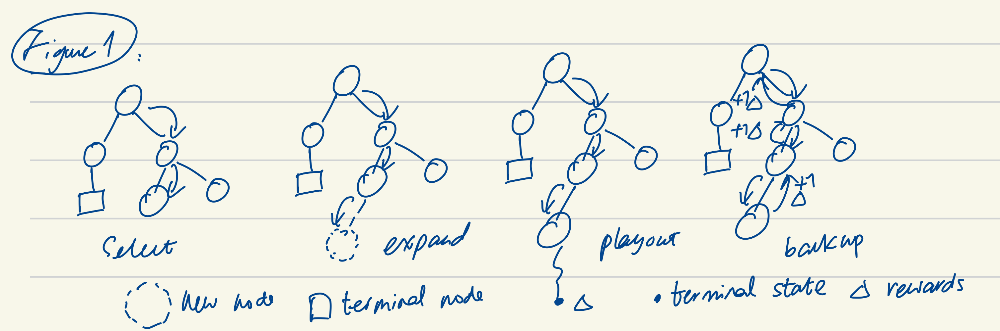

### Selection
<!-- process: root to terminal/expandable node, find best move/child at each level using selection policy -->
The algorithm traverses the nodes in the search tree by finding the best move to play repeatedly using a selection policy, till reaching a terminal or expandable node. A terminal node represents a finished game where no further moves can be played. An expandable node represents a state where some legal moves have not been explored by previous simulation episodes. 

#### Upper Confidence Bounds applied to Trees (UCT)
<!-- process: sum of past average reward and inverse normalized visits -->
UCT (Kocsis et al. 2006) is the most popular selection strategy based on the UCB1 algorithm (Auer et al. 2002). Formula 1 shows the UCT formula to calculate node value. The first term, `q/n`, is the exploitation term representing the average reward from previous simulations through this node. A higher average reward indicates moves that have historically led to favorable outcomes. The second term, `sqrt(c²ln(N)/n)`, is the exploration bonus that grows smaller for nodes more frequently explored than their siblings. The exploration constant `c` (typically `sqrt(2)`) balances the two terms.

<!-- TODO: legend to explain each symbol -->
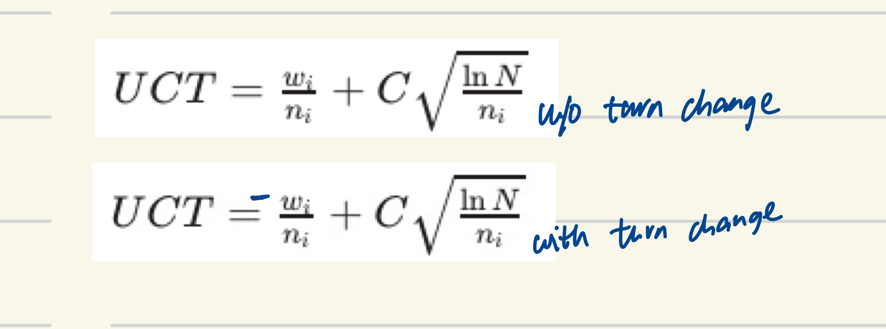

<!-- purpose: balance exploitation/historical performance and exploration/potential good moves -->
<!-- purpose: find the best moves, guide search process -->
UCT helps to choose moves that are either historically well-performing or less visited. Through balancing "exploitation" of known good moves and "exploration" of potentially rewarding alternatives, the selection phase directs the search process to focus on the most promising parts of the tree.

[^Kocsis et al. 2006]: Kocsis, L., Szepesvári, C., & Lőrincz, A. (2006). Bandit based Monte-Carlo planning. In Machine Learning: ECML 2006 (pp. 282-293). Springer Berlin Heidelberg.
[^Auer et al. 2002]: Auer, P., Cesa-Bianchi, N., & Fischer, P. (2002). Finite-time analysis of the multiarmed bandit problem. Machine Learning, 47(2-3), 235-256.

### Expansion
<!-- process: pick an unexplored move, create new node for resulting state, add to parent node/tree -->
<!-- purpose: explore an unexplored move, expand coverage of search space, discover new strategies -->
After selection identifies a promising expandable node, the algorithm randomly picks an unexplored move and creates a new node for the resulting state. The new node is added as a child to the parent node, and their connecting edge represents the picked move newly explored in this simulation. The child becomes a new leaf node in the search tree.

The expansion phase grows the search tree by exploring a move and new state previously unseen by the simulations. This helps the search process to cover more search space and discover new potential outcomes and strategies.

### Playout
<!-- process: leaf to terminal or cutoff, playout policy, reward from outcome or evaluation -->
<!-- purpose: quickly simulate game outcome, basis for move evaluation/node value estimation -->
From the newly added leaf node, a sequence of moves is played outside the tree following a playout policy till reaching a terminal state (full playout) or for a fixed number of moves (playout with cutoff). At the cutoff state, an evaluation function is applied. Based on the game outcome or evaluation result, a reward is calculated for each player. 

The playout phase quickly simulates the outcome of a game from the traversed path. Across many episodes, the simulated outcomes provide the empirical basis and statistical foundation for estimating node value and move quality.

### Backup
<!-- process: propagate reward, leaf to root -->
<!-- purpose: incorporate simulation results, complete feedback loop -->
The algorithm propagates the reward for each player up the search tree by updating the node statistics in the traversed path. From the newly added leaf to the root node, visit count are incremented and rewards accumulated in each node. The updated statistics are then used by the selection process to estimate node values and traverse the tree.

The backup phase completes an episode of simulation by incorporating its result into the search tree. This allows the search process to continue to adapt to new information and refine its decision-making in future iterations.  

<!-- process: many episodes, time/iteration constraint, output policy -->
This four-phase process is repeated till a predefined computational budget, such as time or iterations constraint, is exhausted. With a large number of iterations, the search process eventually runs many simulations and builds up a large search tree with robust statistics. The algorithm then produces a move policy usually based on the visit count of the root node's children. In actual gameplay, either a move sampled from the policy or the move with the highest visits is played.

<!-- purpose: asymetric tree growth, prioritize promising moves in large state space-->
MCTS creates a powerful feedback loop - simulation results inform node statistics, which guide future selections, leading to more informed successive simulations. The exploitation term converges to the true expected value of the node as the number of visits increases, providing increasingly accurate estimates of move quality. The increasingly robust statistical estimates provides a mathematically principled way to guide asymmetric tree growth efficiently towards promising moves while ensuring sufficient exploration of alternatives in a large state space. 

<!-- limitation: need many episodes for robust stats/performance => need to parallelize episodes/tree growth to scale -->
MCTS is computationally intensive, requiring a large number of simulation episodes to sufficiently explore the search space and harvest robust statistics. This presents a direct correlation between the number of episodes and playing strength, making parallelization essential to scale up simulation and enhance gameplay performance for practical applications.

## Chance Nodes
<!-- concept: represent stochastic event with multiple outcomes -->
Chance nodes are introduced in expectimax search to handle stochastic events in adversarial games (Russell & Norvig, 2010). Unlike a normal node which represents a state, a chance node represents a stochastic *event* like dice roll that could lead to multiple different outcomes. Each child of a chance node aligns with a possible outcome from the stochastic event.

<!-- process: 1) add/select chance node (event) 2) add/select child node (outcome) 3) track visits (probability distribution) -->
When applied in MCTS, the use of chance node requires the algorithm to know when a chance event occurs and its outcomes, so a chance node could be added to the search tree instead of a normal node, and a child node could be added for each outcome. The probability distribution of the outcomes also needs to be known, so the outcomes could be sampled accordingly during simulations. Consequently, the statistics in a chance node capture the simulation results from all possible outcomes of this stochastic event in aggregate. When the selection policy computes the value of a chance node, the exploitation term averages the results of its children weighted by their probabilities, which correctly reflects the expected outcome of games passing through this chance node. 

[Figure 3] shows a part of an MCTS tree with a chance node for a chance event with two possible outcomes. Node S represents the game state prior to the dice roll. Chance node A represents the rolling of the dice. Node O1 and O2 each represents an outcome sampled by a previous simulation and already added to the search tree.

<!-- TODO: add node statistics: S 2 wins + 1 loss = 3 simulations, O1 2 wins = 2 simulations, O2 1 loss = 1 simulation -->
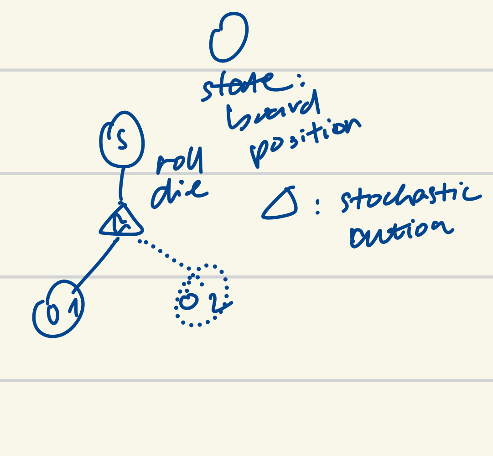

<!-- purpose: account for outcome probabilities-->
This approach allows MCTS to handle games with randomness by incorporating the true probabilities into the search process and the tree statistics through repeated outcome sampling. The collective simulation results across all outcomes inform the true value of the chance node, enabling the algorithm to make decisions accounting for the inherent uncertainty in stochastic games.

## Parallel MCTS
Monte-Carlo Tree Search can be parallelized in three main ways to leverage on the full processing power of multi-core machines (Chaslot et al. 2008). Each approach offers different tradeoffs between implementation complexity, memory usage, scaling efficiency, and synchronization overhead.

### Leaf Parallelization
Leaf parallelization, depicted in Figure 2a, traverses the search tree using a single thread and executes multiple independent playouts from the same leaf node across multiple threads in parallel. The results from these parallel playouts are aggregated before being backed up.

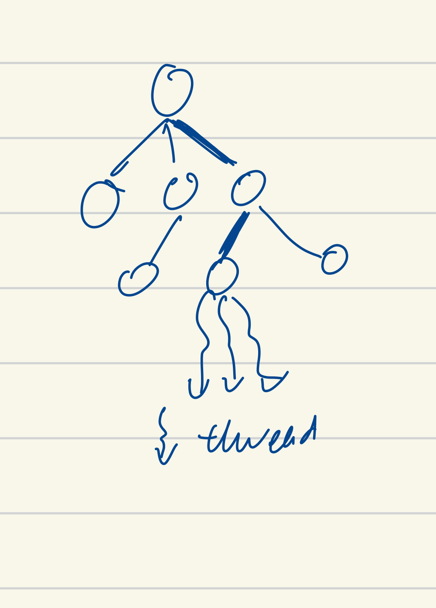

This approach is the simplest to implement since it only requires synchronization for combining playout results. However, as the tree traversal remains sequential and only the playout phase is parallelized, it achieves limited parallelism. Additionally, there is significant waste during the parallel playouts, as the slowest playout effectively becomes the bottleneck while many slow playouts may share the same unfavorable outcomes. Futhermore, the potential gains diminish deeper into the games when rollouts are shorter or when evaluation functions are used instead of playing to terminal states.

### Root Parallelization 
Root parallelization, shown in Figure 2b, constructs multiple independent search trees in parallel, each starting from the same root state but using different random seeds. Each thread maintains its own complete tree and runs the standard MCTS algorithm. The root statistics from all trees are only merged periodically or combined at the end to make the final move decision. 

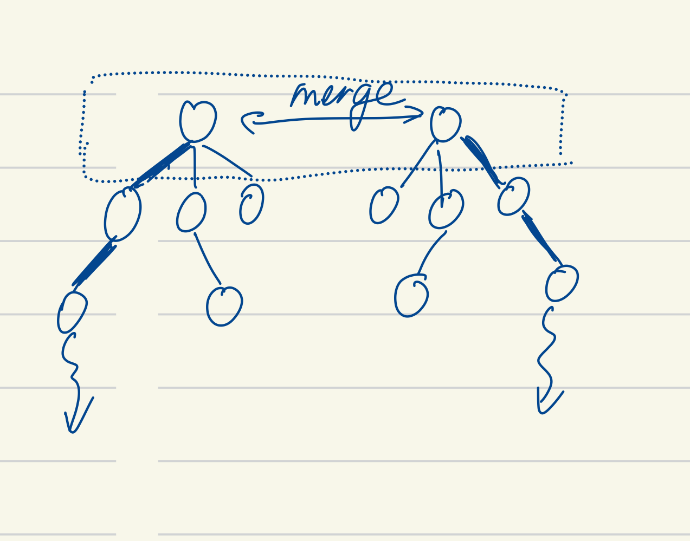

This approach achieves a high level of parallism and scales well since the trees are completely independent, not requiring thread synchronization during the simulation episodes. However, maintaining a search tree in each thread can be memory intensive. It may also explore the same paths across different trees redundantly if not randomized properly, rendering lower search efficiency than a single tree of equivalent size.

### Tree Parallelization
Tree parallelization maintains a single shared search tree that multiple independent threads traverse and update concurrently. This introduces the challenge of preventing data corruption should multiple threads visit and update the same parts of the tree. Figure 2c illustrates 3 race condition scenarios where simulateneous access to the same node by multiple threads could lead to data corruption without proper synchronization[^lock_free]. 

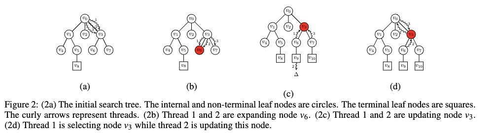

[^lock_free]: A Lock-free Algorithm for Parallel MCTS https://liacs.leidenuniv.nl/~plaata1/papers/paper_ICAART18.pdf 

To maintain data consistency, one of two forms of locking mechanism is usually employed. 

#### Global Mutex
One simple implementation uses a single global mutex to protect the entire search tree. As Figure 2d illustrates, only a single thread accesses the tree to perform selection, expansion and backup at a time. Meanwhile, other threads perform playouts from different leaf nodes in parallel. Consequently, the maximum speedup is capped by the amount of time each thread spends inside the tree.

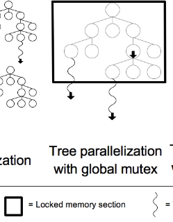

#### Local Mutexes with Virtual Loss
A more sophisticated approach uses fine-grained locking with a mutex in each node. Depicted in Figure 2e, a thread acquires the local mutex when it visits a node and releases it before it departs. By incrementing the visit count and adding a negative reward before the actual playout, a virtual loss is temporarily applied on the visited node and is reversed later during backup. 

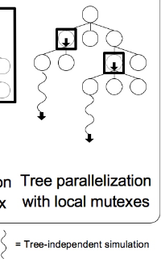

This temporary penalty on the node being explored discourages other threads from selecting the same nodes, naturally distributing threads to explore different parts of the tree. If multiple threads still select the same path, the virtual losses accumulate on these nodes, making them progressively less attractive for selection. This reduces lock contention and results in more varied exploration of possible game paths. However, more granular and frequent locking incurs higher memory footprint and synchronization overheads, and therefore, requires lightweight and fast-access mutexes such as spin-locks to maximize the speedup.

## Risk Agents 
<!-- contributions and limitations -->

### Action Pruning
<!-- TODO: MCTS for Risk 1) action pruning: rules change to limit action/state space -->

### Multi-Step Decisions
<!-- TODO: Playing the Game of Risk with an AlphaZero Agent: multi-step decisions, adapt MCTS agent for AlphaZero agent, good blueprint/starting point
limitations: 1) TODO -->

<!-- TODO: Jean's implementation in Python: limitations 1) sequential: does not scale, limited to N searches/iterations per minute 2) monolithic: no game tree separation 3) single agent: single shared tree for both players, metrics: MCTS agent vs random -->

<!-- TODO: reiterate our motivation/differentiation 0) game tree abstraction 1) parallelized MCTS agent with higher performance 2) support multi-agency: MCTS agent vs MCTS agent 3) adapt MCTS agent for future AlphaZero training -->

# Implementation 
<!-- TODO: transition: define objectives/scope of work -->
<!-- introduce contents in this chapter: MCTS simulate games with deterministic moves, chance nodes to accommodate stochastic events/attack, parallelization to scale/speed up simulations -->
<!-- generic to any deterministic or stochastic game implementing the interface -->

## Risk Game
<!-- TODO: implemented rules change to limit state/action space, perfect information -->
multi-step decisions: reinforcement, attack and fortify phases 

## MCTS
Given a game state, the MCTS implementation runs a series of simulation episodes to build up a search tree and identify the most promising move to play. To start, the implementation creates a root node representing the given game state. The root node is initialized with a visit count and rewards of 0. The root node is also initialized with edges that each represent a possible legal move from the game state. At this point, the search tree contains only the root node and the root node has no children. Each episode then begins at the root node and run a simulated game through the selection, expansion, playout and backup steps. The simulation grows the search tree and update its statistics. To reduce memory footprint, state is not stored in the tree nodes and is maintained separately by each episode. 

### Selection: Traversing The Tree
Starting from the root node, the implementation traverses the search tree to continuously identify promising moves and advance the simulated game state. Figure 4 illustrates the selection process implementation. At each node, the implementation checks if the node has any children and unexplored moves. A node with children and no unexplored move is non-terminal and fully expanded with a child for each legal move. The implementation then calculates the UCT value for each child to find the child with the highest value. The simulated state advances by playing the move leading to the highest value child, and the process repeats at the child. Otherwise, selection ends at a terminal or expandable node if the node has no children or has unexplored moves.

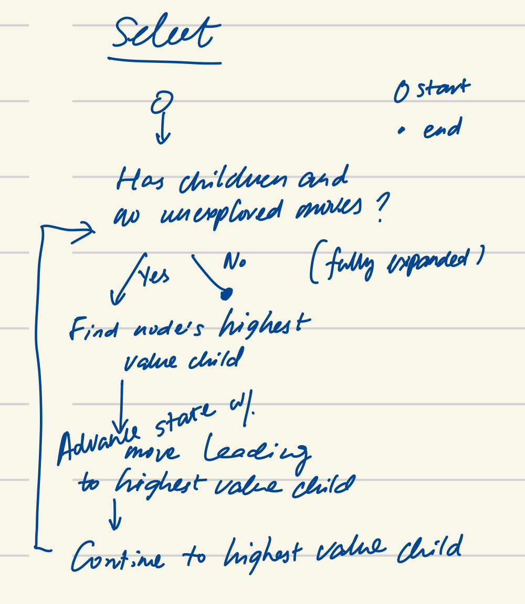

#### UCT: Selecting The Best Move
Each node maintains two important statistics: visit count and accumulated rewards. Visit count captures the number of times simulations have passed through this node. Rewards store the rewards accrued from the results of these simulations. The value of a child node is computed by applying the UCT formula in [Formula 1], given the child rewards and visit count as well as the parent visit count. 

Rewards always reflect the historical outcomes from the perspective of the player making the move at the node. Assuming both are rational players in a zero-sum two-player game, maximizing one player's average reward is equivalent to minimizing the opponent's. Therefore, when the parent and child players differ, child rewards are negated in the UCT computation at the parent node. This flip accommodates the shift in perspective in the presence of a turn change. 

### Expansion: Growing The Tree
When selection encounters a node with unexplored legal moves, the expansion phase adds a new leaf node to the search tree for one of these moves. Figure 5 shows the expansion steps. The implementation randomly chooses an unexplored move and plays this move to advance the simulated state. A new node is then created to represent the resulting state. The new node is initialized with a visit count and rewards of 0 as well as all the legal moves of the resulting state for creating its own children in future episodes. Subsequently, the new node is added to the parent and the tree grows one leaf node.

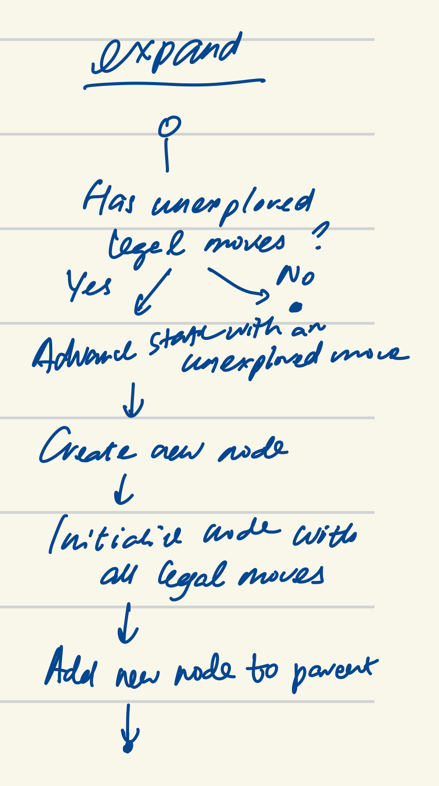

### Playout: Simulating The Outcome
From the new leaf node added during expansion, the playout phase finishes the simulated game by following a playout policy for move selection outside the tree. A playout policy can be random or heuristic-based. A random policy samples a move uniformly at random from all legal moves at each state. A heuristic-based policy incorporates domain-specific knowledge and strategies to emulate high-level human players in hopes of rendering more intelligent and realistic playouts. 

The implementation uses a random playout policy in favor of its speed and simplicity. Random playouts are fast and allows for a large number of simulations in a time-constrained setting. This enables the search process to quickly explore a wide variety of possible game paths across simulations, providing a potentially broad perspective on possible outcomes. Moreover, a static set of heuristics brings added computational complexity and does not adapt well to the configurable and changing nature of the game rules. Furthermore, since the playout phase is ultimately replaced by a value network in an AlphaZero approach, simple random playouts suffice as a starting point.

The implementation supports playout till no further moves is possible or a specified number of moves is played. [Figure 6] illustrates the playout phase implementation for both. 

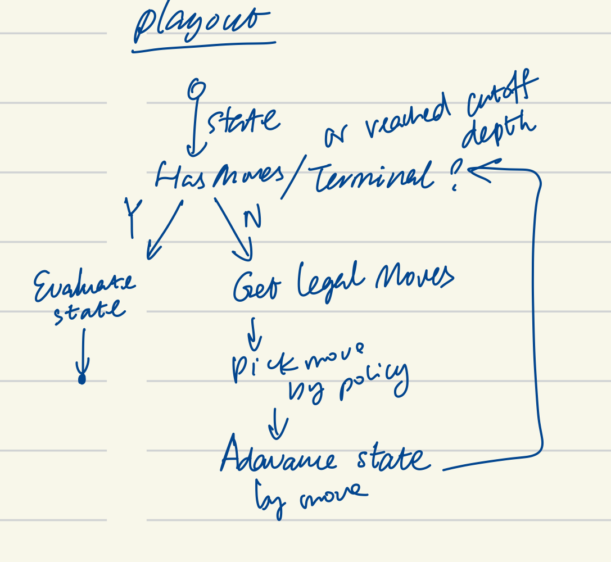

#### Full Playout
The implementation plays out the game till no moves could be played. At this point, the game has a definite winner determined by the game rules. A win carrying a reward of 1 is set for the leaf node's player, if it is the same player as the winner. Otherwise, a loss carrying a reward of -1 is set for the leaf node's player.

#### Playout with Cutoff
With a predefined cutoff depth, the implementation plays only the specified number of moves during playout. Upon reaching the cutoff depth, an evaluation function is applied on the cutoff state to estimate the potential outcome from the current player's perspective, without simulating the rest of the game. 

The implementation provides two evaluation functions:

1. Resource Evaluation: This evaluation function simply tallies the number of territories, troops and continents controlled by a player and computes an equally weighted sum. This uses the sheer amount of resources as a reflection of a player's ability to win the game compared to his opponent.

2. Border Strength Evaluation: In addition to the resource tally, this evaluation function calculates the troop difference between each pair of a player's border territory and adjacent enemy territory. This incorporates a few game-specific heuristics. Troop difference directly correlates to the likelihood of a territory being captured by its enemy neighbor in an attack, since each additional troop allows the attacker to roll the dice once more. Moreover, by summing the troop difference with all of a territory's enemy neighbors, it factors in the connectedness of that border territory. If the calculation of troop difference accumulates for a well-connected border territory, it reflects its higher strategic value in the game, as more highly connected territories offer more paths for attack and defense and could be a valuable target in expanding territories and capturing continents. 

Both evaluation functions normalizes a player's score relative to the other player's score to return a floating-point number between -1 and 1. The evaluation result reflects the position of the player at the cutoff state. Positive values mean a winning position, and negative values losing. The absolute value indicates how strong the winning or losing position is. This result estimates the potential outcome should playout completes from the cutoff state, and is, therefore, directly used as the reward. A reward equal to the evaluation result is set for the leaf node's player, if it is the same player as the cutoff state's. Otherwise, the result is negated as the reward, to reflect the estimated outcome from the opponent's perspective.

### Backup: Propagating The Result
The backup step starts at the new leaf node and continues up the traversed path to the root node recursively. Shown in [Figure 7], at each node, the implementation first increments the visit count by one. To accommodate possible turn change, it then considers whether the node represents the same player as the leaf node. If yes, the playout reward is added to the node's rewards. Otherwise, the playout reward is flipped before being accumulated. 

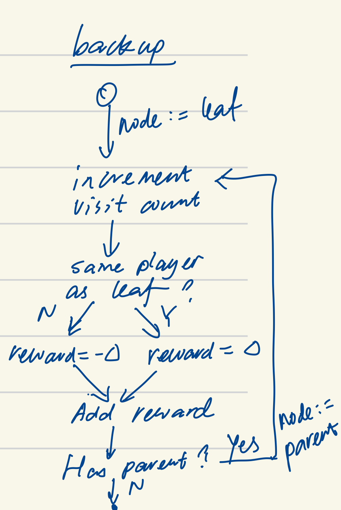

For example, consider a playout that ends in a win (reward 1.0) for the player at the leaf node. When being propagated to a parent node where it was the opponent's turn, the result becomes a loss (reward -1.0) from the parent node player's perspective. Similarly, a playout with cutoff that results in a score and reward of 0.5 for the player at the leaf node would be negated to -0.5 when propagated to a parent node whose player is the opponent.

This ensures the node statistics always capture simulation results from the perspective of the player making the next move at the node. The average reward, calculated by the exploitation term, of all simulations passing through the node correctly estimates the expected outcome from this node for the player making a decision at the node. The UCT selection policy can then directly use the rewards value to calculate the value of a node with regards to its parent.

## Chance Nodes
The implementation extends the standard MCTS tree structure with chance nodes to handle stochastic events in the Risk game, specifically the dice rolls when an attack is launched. When an attack move is selected during tree traversal, a chance node is created if it does not exist already, to represent the dice roll event. Unlike regular nodes which maintain a mapping between moves and child nodes, a chance node simply maintains a group of child nodes, each representing a distinct outcome state encountered through previous simulations. The implementation identifies outcomes by computing a hash of the game state after the dice roll. This hash captures the essential elements of the state affected by the dice roll, such as troop counts and terroritory ownership, to distinguish one resulting state from another.

When the chance node is encountered again during selection, the implementation first computes the hash of the resulting state after the dice roll. It then searches through the existing child nodes for a matching hash. If found, that child node is selected, representing the same dice roll outcome and resulting state being encountered again, and the selection process continues onto the child. If no matching outcome exists, expansion occurs and a regular node is created for this new outcome and added to the chance node's list of children. Figure 8 describes this selection and expansion process of chance nodes based on the move's outcome. This process allows the search tree to gradually discover and incorporate different possible outcomes of the stochastic event.

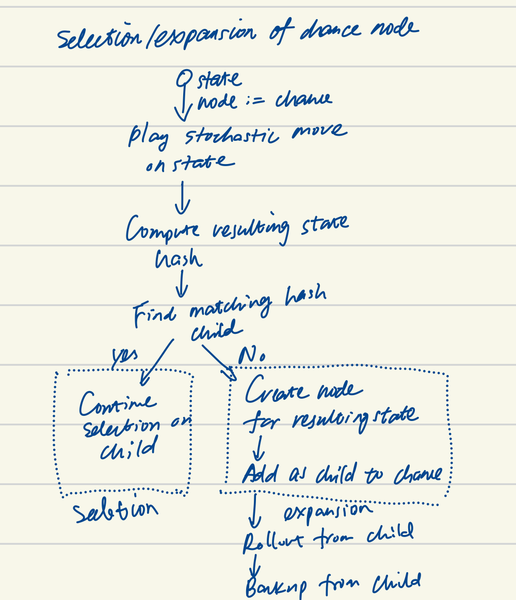

Figure 9 shows how a subtree with a chance node grows over 4 episodes. The initial subtree contains only Node S. In Episode 1, selecting an attack from Node S expands the node to add a triangular chance node representing the dice roll. Episode 2 selects the same attack move and expands the chance node with child O1 for the dice roll outcome. During Episode 3, the attack produces a different dice roll outcome, expanding the chance node again with another child O2. In Episode 4, the attack yields the same outcome as Episode 2, so the existing child O1 is selected and subsequently expanded with an unexplored move. In all four episodes, playout and backup follows the standard MCTS procedure, always beginning from the newly added node representing a new game state.

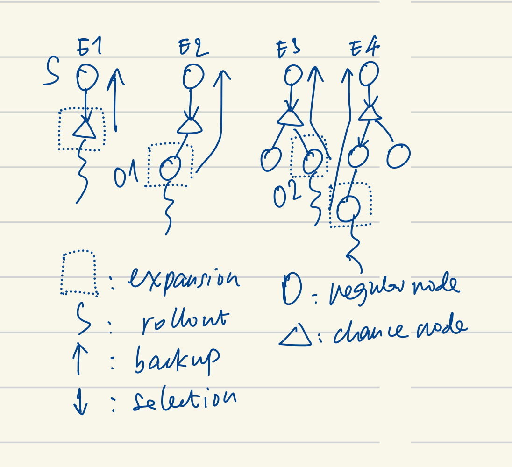

During backup, a chance node accumulates visits and playout rewards from all its outcome nodes, and thus, maintains aggregate statistics of all simulations that pass through it. These statistics represent the expected value of the attack move across all possible dice roll outcomes. When the selection policy evaluates an attack move during tree traversal, it uses these aggregate statistics of the corresponding chance node, effectively considering the average case performance of the attack across different possible outcomes.

## Tree Parallelization
The implementation parallelizes the MCTS search using tree parallelization with local mutexes for thread synchronization and virtual losses for thread distribution. This is the natural approach for shared memory systems to take full advantage of the available bandwidth to communicate simulation results (Enzenberger and Müller 2010), and enables concurrent tree growth at scale while maintaining a single shared search tree. 

### Local Mutex: Preventing Race Conditions
Each node in the tree is protected by its own mutex, which must be acquired before any operation on the node's data. Three race condition scenarios exist in parallelized MCTS: two threads concurrently expanding the same node (Shared Expansion), two threads concurrently updating statistics of the same node (Shared Backup), and two threads concurrently updating and selecting the same node (Shared Backup and Selection) (Mirsoleimani et al. 2018). The locks are managed carefully across three tree operations, selection, expansion and backup, to avoid these race conditions. Since playout happens outside the tree, this phase is naturally parallelized across threads without any locking. 

The thread acquires and releases the lock one node at a time as it traverses the tree for selection and expansion. When a thread visits a node, it acquires the node's lock before checking for unexplored moves and children. Selecting and expanding a node are implemented as a single atomic operation. If selection occurs, the implementation iteratively acquires each child's lock to read its statistics for UCT calculation, releasing the lock immediately after. Once the highest value child is found, the parent's lock is released. If expansion occurs, the lock is held until a new child is created and added to the node. This ensures that two threads cannot simultaneously expand the same node. 

The iterative locking of children during selection allows other threads to access and update the children not currently being evaluated. For example, while selection is computing the value of one child, another child's statistics could be updated by backup in another thread, changing its value. An alternative considered is lock the parent and all its children en bloc. However, this significantly complicates the implementation and hampers parallelism, as it requires all children to be free prior to locking multiple nodes at once. In practice, MCTS can handle noise rather well with no strong need for perfect consistency (Enzenberger and Müller 2010). The volume of simulations and the random nature of MCTS drown out temporary inconsistencies and converge node statistics to their true values over time. The iterative locking approach is a deliberate trade-off for greater parallelism at the cost of data consistency. 

During backup, the thread also acquires and releases locks one node at a time as it propagates the simulation result up the tree. At each node, the thread first acquires that node's lock, updates the node's visit count and accumulated rewards and releases the lock, before moving on to acquire the parent node's lock. This prevents threads from updating the same node simultaneously or updating and selecting the same node at the same time. 

### Virtual Loss: Distributing The Search
The virtual loss mechanism reduces lock contention on local mutexes by distributing threads across the search tree. When a node is selected or expanded, the implementation immediately applies a loss, the worst possible outcome, to the node by incrementing the visit count and adding a loss reward. This temporary loss is reversed when the node's statistics are updated with the actual simulation result during backup. This technique could be particularly effective for Risk even with a high level of parallelism, since its large branching factor provides ample opportunity for threads to explore different moves.

## Tree Reuse 

## Gameplay
### Action Pruning 
### Multi-Agency (Game-Tree Integration)
<!-- TODO: computational budget: time or iterations -->

# Results
## Playout Cutoff
<!-- the cutoff depth is a limit set to prevent simulations from running indefinitely, especially in games with large state spaces or long sequences of moves. -->
<!-- 
The results of the playout phase are crucial for the subsequent backup phase, where the statistics gathered during the simulation are used to update the values of nodes in the search tree. The playout outcome, whether a win, loss, or draw, is propagated back up the tree to inform the selection policy in future iterations.
 -->

 This allows the search to be scaled based on available computational resources, from single-threaded execution to many concurrent threads. The effectiveness of parallelization is influenced by several factors including the branching factor of the game, the depth of the tree, and the ratio of time spent in tree traversal versus simulation. The local mutex with virtual loss approach is particularly effective for Risk, where the large branching factor and relatively expensive simulations provide ample opportunity for threads to naturally distribute across different parts of the search space.

 # Other Findings
 ## An AlphaZero Approach
 extend it to play stochastic games 